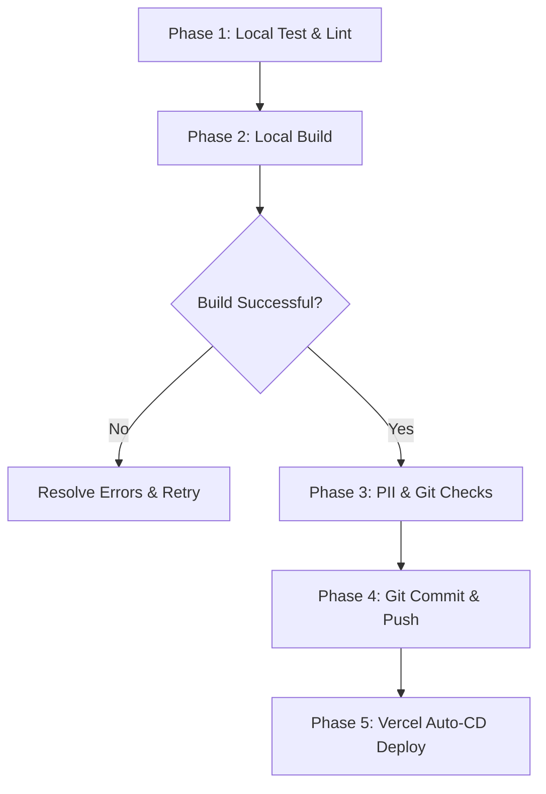

# 🚀 Development & Deployment Protocol (Test, Build, Push, Deploy)

This document establishes the official step-by-step pipeline for building, validating, and deploying changes to MyTokenCost.com. To maintain high availability, security, and type safety, developers and AI agents must strictly execute each phase in order before merging or pushing code to the remote repository.

---

## 📋 The Unified Pipeline Flowchart



---

## 🛡️ Phase 1: Local Test & Lint (Validation Gate)
Before compiling the project, run local quality assurance scripts to detect style guidelines violations, React compiler purity issues, or unused dependencies.

1.  **Run Linter**:
    ```bash
    npm run lint
    ```
    Ensure exactly `0` linting errors are present. Pay close attention to React 19 rules (e.g., escaping unescaped entities, avoiding synchronous `setState` during effect rendering).
2.  **Run Type Checks**:
    ```bash
    npx tsc --noEmit
    ```
    This acts as a strict type gate to prevent any silent compilation crashes on Vercel. There must be exactly `0` type errors or warnings.

---

## ⚙️ Phase 2: Local Build (Compilation Gate)
Never rely entirely on Vercel's remote servers to test code packaging. Always run a local production build first to confirm successful static and dynamic routing optimization.

1.  **Execute Local Production Build**:
    ```bash
    npm run build
    ```
2.  **Verify Asset Generation**:
    Ensure Turbopack successfully outputs all compiled routes (e.g., `/`, `/calc/*`, `/sandbox/*`, `/portal/*`) and stores them inside the local `.next` directory cache without crashes.

---

## 🔒 Phase 3: PII & Git Checks (Privacy Safeguards)
Data privacy is our primary value proposition. We must ensure no Personally Identifiable Information (PII) or sensitive keys leak into version control.

### 1. Unified `.gitignore` Management
Verify that `.gitignore` is fully up-to-date and covers all diagnostic, workspace, and configuration files that could leak credentials. The following paths must be strictly ignored:

*   **Secrets & Credentials**: `.env`, `.env.local`, `.env.*` (Supabase, Clerk, Stripe keys).
*   **Editor & IDE State**: `/.vscode/`, `/.idea/` (prevents leaking local directories, paths, or settings).
*   **System Diagnostics**: `*.log` (avoids pushing server activity or token dumps), `.system_generated/`, `/scratch/`, `/tmp/`, `/temp/`.
*   **Next.js Internals**: `/.next/`, `/out/`, `*.tsbuildinfo`, `next-env.d.ts`.
*   **Clerk Configs**: `/.clerk/`.

### 2. Manual Code Scrubbing
Before staging, review your modified code to make sure:
*   No **hardcoded API keys** or client tokens are present in hooks, actions, or views.
*   No **client corporate identifiers**, corporate email addresses, or database seed data containing actual client names or transaction IDs are present in database migrations or sandbox routes.
*   All customer-facing text uses placeholder components or generates randomized test numbers (like ticket IDs) inside pure event handlers.

---

## 📤 Phase 4: Git Commit & Push (Release Gate)
Once the build is verified and code has been scrubbed for PII, you are ready to stage and check in your changes.

1.  **Check Git Status**:
    ```bash
    git status
    ```
    Confirm that only files relevant to the active task are listed. Ensure no untracked `.env` files or logs are visible.
2.  **Stage Files**:
    ```bash
    git add .
    ```
3.  **Commit Code**:
    Apply clear semantic messages so team members can scan the changelog:
    ```bash
    git commit -m "feat: add secure real-time ERCOT grid calculator"
    ```
4.  **Push to Branch**:
    ```bash
    git push origin main
    ```

---

## 🌐 Phase 5: Vercel Auto-CD Deploy (Continuous Deployment)
With Vercel successfully integrated with GitHub, your push will automatically trigger a production deploy.

1.  **Verify Project Settings**:
    *   **Framework Preset**: Must be set to **`Next.js`**.
    *   **Build Command & Output Directory**: Overrides must be turned **OFF** (allowing Vercel to default to `next build` and `.next`).
2.  **Confirm Build Progress**:
    Open the Vercel Dashboard for `my-token-cost` and verify:
    *   The build duration is a realistic Next.js compile window (typically 30–90 seconds).
    *   The deployment state transitions fully to **`Ready`** (Active).
3.  **Live Functional Verification**:
    Open [www.mytokencost.com](https://www.mytokencost.com) and test the updated pages, forms, and calculators in your browser to confirm routing and middleware are operating nomially.
